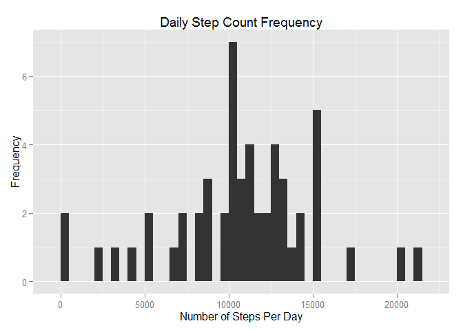
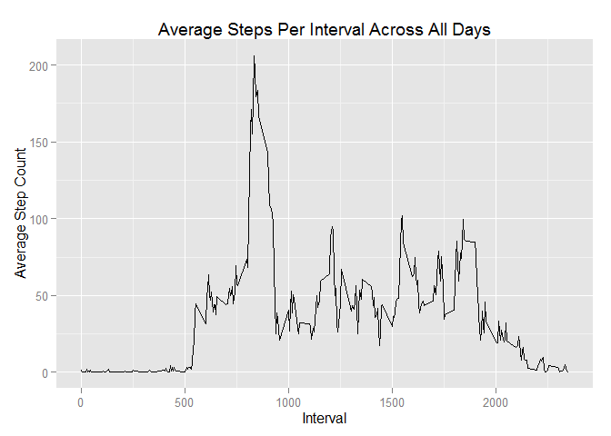
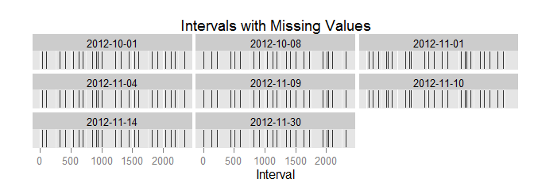
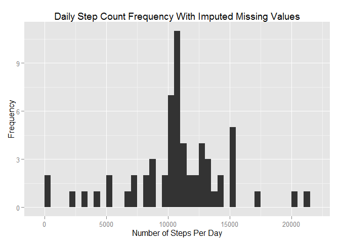
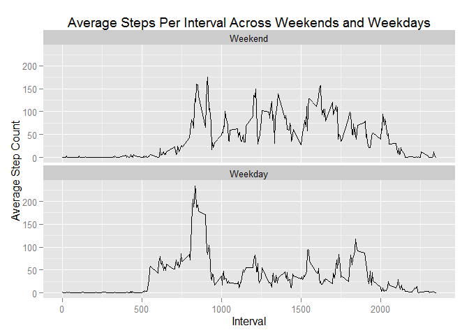

# Reproducible Research: Peer Assessment 1


## Loading and preprocessing the data
The data package was acquired in a compressed format and must be unzipped. After extracting the archive contents, the data can be read in.

```r
unzip(zipfile = "activity.zip")
activity <- read.csv(file = "activity.csv",
                     stringsAsFactors = FALSE)
```
The `date` attribute is stored as a YYYY-MM-DD format string and needs to be parsed for use as a date.

```r
library(lubridate)
activity$date <- ymd(activity$date)
```
After this processing, the data is ready for analysis.

```r
head(activity)
```

```
##   steps       date interval
## 1    NA 2012-10-01        0
## 2    NA 2012-10-01        5
## 3    NA 2012-10-01       10
## 4    NA 2012-10-01       15
## 5    NA 2012-10-01       20
## 6    NA 2012-10-01       25
```

## What is mean total number of steps taken per day?
The `reshape2` package can be used to aggregate the data to daily buckets.

```r
library(reshape2)
melted <- melt(data = activity,
               id.vars = c("date", "interval"),
               measure.vars = c("steps"),
               na.rm = TRUE)
dailyActivity <- dcast(data = melted,
                       formula = date ~ variable,
                       fun.aggregate = sum)
```

This new daily dataset can be plotted in a histogram using the `ggplot2` package.

```r
library(ggplot2)
ggplot(data = dailyActivity,
       aes(x = steps)) +
    stat_bin(geom = "bar",
             binwidth = 500) +
    labs(title = "Daily Step Count Frequency",
         x = "Number of Steps Per Day",
         y = "Frequency")
```

 

The mean and median daily step count can be computed trivially from the aggregated dataset.

```r
with(dailyActivity,
     c(Mean = mean(steps),
       Median = median(steps)))
```

```
##     Mean   Median 
## 10766.19 10765.00
```

## What is the average daily activity pattern?
The data can also be summarized by averaging the number of steps in a given interval across all days.

```r
intervalActivity <- dcast(data = melted,
                          formula = interval ~ variable,
                          fun.aggregate = mean)
ggplot(data = intervalActivity,
       aes(x = interval,
           y = steps)) +
    geom_line() +
    labs(title = "Average Steps Per Interval Across All Days",
         x = "Interval",
         y = "Average Step Count")
```

 

The interval with the highest average step count can be determined from the aggregated data. Finding the maximum number of steps in an interval and then filtering the data frame by matching against that maximum ensures that we do not miss intervals being tied for most steps.

```r
highestIntervals <- intervalActivity[which(intervalActivity$steps == max(intervalActivity$steps)),]
highestIntervals$interval
```

```
## [1] 835
```

## Imputing missing values
A number of intervals in the dataset are missing values.

```r
incompleteIntervals <- is.na(activity$steps)
c(MissingValues = sum(incompleteIntervals))
```

```
## MissingValues 
##          2304
```

Any pattern to where the missing values are occurring may influence which method we should use to choose values to use for the incomplete intervals.

```r
activityIncomplete <- activity[incompleteIntervals,]
ggplot(data = activityIncomplete,
       aes(x = interval)) +
    geom_histogram(binwidth = 1) +
    facet_wrap(~date) +
    scale_y_continuous(breaks = NULL) +
    labs(title = "Intervals with Missing Values",
         x = "Interval",
         y = "")
```

 

Although there is a very clear pattern to how missing values are distributed across a day that has missing values, the distribution of days that have missing values seems relatively random. With this in mind, we will use the average step count for a given interval across all days to fill in the missing values that exist.

```r
library(dplyr)
completeActivity <- left_join(x = activity,
                              y = intervalActivity,
                              by = "interval")
completeActivity[incompleteIntervals,] <- within(completeActivity[incompleteIntervals,],
                                                 steps.x <- steps.y)
completeActivity <- completeActivity[,c("steps.x", "date", "interval")]
colnames(completeActivity) <- c("steps", "date", "interval")
head(completeActivity)
```

```
##       steps       date interval
## 1 1.7169811 2012-10-01        0
## 2 0.3396226 2012-10-01        5
## 3 0.1320755 2012-10-01       10
## 4 0.1509434 2012-10-01       15
## 5 0.0754717 2012-10-01       20
## 6 2.0943396 2012-10-01       25
```

The methods applied previously to analyze the original data in daily buckets can now be applied to this new dataset with the missing values filled in.

```r
completeMelted <- melt(data = completeActivity,
                       id.vars = c("date", "interval"),
                       measure.vars = c("steps"))
completeDailyActivity <- dcast(data = completeMelted,
                               formula = date ~ variable,
                               fun.aggregate = sum)
ggplot(data = completeDailyActivity,
       aes(x = steps)) +
    stat_bin(geom = "bar",
             binwidth = 500) +
    labs(title = "Daily Step Count Frequency With Imputed Missing Values",
         x = "Number of Steps Per Day",
         y = "Frequency")
```

 

```r
with(completeDailyActivity,
     c(Mean = mean(steps),
       Median = median(steps)))
```

```
##     Mean   Median 
## 10766.19 10766.19
```

With no appreciable change in the results, we can conclude that the presence of the missing values did not introduce significant bias into the previous analysis.

## Are there differences in activity patterns between weekdays and weekends?
If we divide our data into weekdays and weekends before applying the previous analysis for interval buckets, we can look for differences in the profile of a weekend day versus a weekday day.

First we need to determine which days fall on weekends and reshape the data.

```r
library(chron)
dividedActivity <- activity
dividedActivity$weekend <- factor(is.weekend(dividedActivity$date),
                                  levels = c("TRUE", "FALSE"),
                                  labels = c("Weekend", "Weekday"))
dividedMelted <- melt(data = dividedActivity,
                      id.vars = c("weekend", "date", "interval"),
                      measure.vars = c("steps"),
                      na.rm = TRUE)
dividedIntervalActivity <- dcast(data = dividedMelted,
                                 formula = weekend + interval ~ variable,
                                 fun.aggregate = mean)
```

With the data transformed, we can compare weekends and weekdays directly

```r
ggplot(data = dividedIntervalActivity,
       aes(x = interval,
           y = steps)) +
    geom_line() +
    facet_wrap(~weekend,
               ncol = 1) +
    labs(title = "Average Steps Per Interval Across Weekends and Weekdays",
         x = "Interval",
         y = "Average Step Count")
```

 

Several differences are apparent between weekends and weekdays. Foremost among these are a consistently earlier start to activities on weekday mornings and an overall higher level of activity on weekend afternoons.
